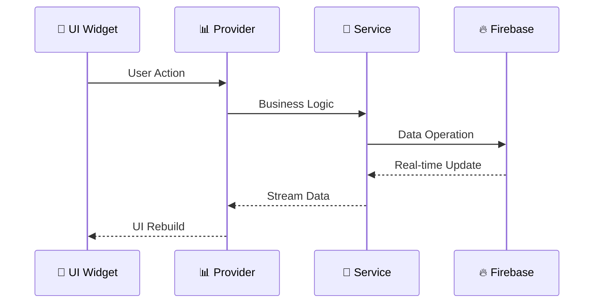
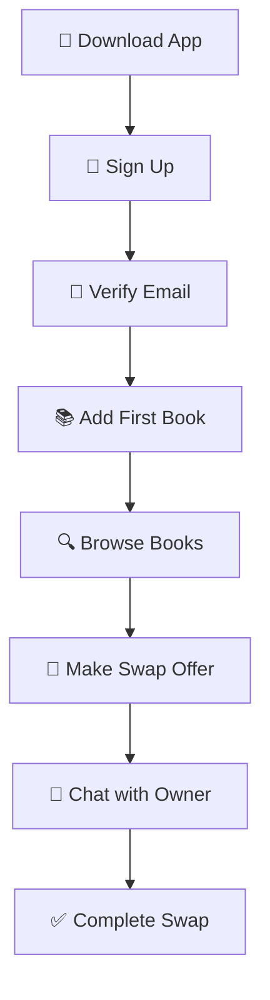

# 📚 BookSwap - Student Textbook Exchange Platform

<div align="center">


[](https://flutter.dev)
[](https://firebase.google.com)
[](https://dart.dev)
[](https://pub.dev/packages/provider)

**🎓 A modern Flutter mobile application enabling students to exchange textbooks through a marketplace system with real-time chat functionality.**

*Connecting students, sharing knowledge, building community* 📖✨

**📅 November 2025**

[🚀 Demo Video](#-demo-video) • [📱 Screenshots](#-app-screenshots) • [🛠️ Installation](#-installation) • [🎯 Features](#-features) • [🏗️ Architecture](#️-architecture)

</div>

---

## 🌟 Overview

BookSwap revolutionizes how students exchange textbooks by providing a seamless, real-time platform for book trading. Built with Flutter and Firebase, it offers a premium dark-themed UI with smooth animations and instant synchronization across devices.

### 🎯 Problem Statement
- Students struggle to find affordable textbooks
- Unused textbooks pile up after semester ends
- No centralized platform for student-to-student exchanges
- Lack of trust and communication in peer-to-peer trading

### 💡 Solution
BookSwap creates a **trusted marketplace** where students can:
- 📚 List textbooks with detailed information and photos
- 🔄 Initiate swap offers with real-time status tracking
- 💬 Communicate directly through integrated chat system
- 🔐 Trade safely with verified student accounts

### 👨💻 Developer Information
<table>
<tr>
<td><strong>Developer</strong></td>
<td>Aman Kasa</td>
</tr>
<tr>
<td><strong>Email</strong></td>
<td><a href="mailto:a.kasa@alustudent.com">a.kasa@alustudent.com</a></td>
</tr>
<tr>
<td><strong>University</strong></td>
<td>African Leadership University</td>
</tr>
<tr>
<td><strong>Coach/Facilitator</strong></td>
<td>Samiratu</td>
</tr>
<tr>
<td><strong>Repository</strong></td>
<td><a href="https://github.com/Aman-Kasa/BookSwap_app.git">BookSwap_app</a></td>
</tr>
<tr>
<td><strong>Demo Video</strong></td>
<td><a href="#-demo-video">📹 Watch Demo</a></td>
</tr>
</table>

---

## 📱 App Screenshots

<div align="center">

### 🔐 Authentication Flow

<div align="center">

| Splash Screen | Login Screen | Sign Up | Email Verification |
|:---:|:---:|:---:|:---:|
| <br/>**📚 BookSwap**<br/>*Dark themed splash*<br/>*App logo & branding* | <br/>**🔐 Sign In**<br/>*Email & Password*<br/>*Firebase Auth* | <br/>**📝 Create Account**<br/>*University email*<br/>*Profile setup* | <br/>**📧 Verify Email**<br/>*Required step*<br/>*Security check* |

</div>

### 📚 Main Application Tabs

<div align="center">

| Browse Books | My Listings |
|:---:|:---:|
| <br/>**🔍 Discover Books**<br/>*Grid view of textbooks*<br/>*Search & filter*<br/>*Real-time updates* | <br/>**📚 Your Books**<br/>*Manage listings*<br/>*Edit & delete*<br/>*View offers* |

| Chat Rooms | Settings |
|:---:|:---:|
| <br/>**💬 Messages**<br/>*Real-time chat*<br/>*Chat history*<br/>*Auto-created* | <br/>**⚙️ Profile**<br/>*User management*<br/>*Preferences*<br/>*Account settings* |

</div>

### 🔄 Book Management Features

<div align="center">

| Add New Book | Book Details | Edit Book |
|:---:|:---:|:---:|
| <br/>**➕ Add Book**<br/>*📸 Photo upload*<br/>*📝 Details form*<br/>*🏷️ Condition rating* | <br/>**📖 Book Details**<br/>*📊 Full info view*<br/>*👤 Owner details*<br/>*🔄 Swap button* | <br/>**✏️ Edit Book**<br/>*🔄 Update info*<br/>*📸 New photos*<br/>*💾 Save changes* |

</div>

### 💬 Real-time Chat System

<div align="center">

| Chat List | Live Messages | Swap Offers |
|:---:|:---:|:---:|
| <br/>**📋 Active Chats**<br/>*💬 All conversations*<br/>*👁️ Last message*<br/>*🔴 Unread count* | <br/>**⚡ Real-time Chat**<br/>*💬 Instant messaging*<br/>*⏰ Timestamps*<br/>*✍️ Typing indicators* | <br/>**🔄 Swap Management**<br/>*⏳ Pending offers*<br/>*✅ Accept/Reject*<br/>*📊 Status tracking* |

</div>

</div>

### 🎨 UI/UX Highlights
- 🌙 **Dark Theme**: Modern, eye-friendly dark interface
- 🎭 **Smooth Animations**: Fluid transitions and micro-interactions
- 📱 **Responsive Design**: Optimized for all screen sizes
- 🎯 **Intuitive Navigation**: Bottom tab bar with clear icons
- 🔄 **Real-time Updates**: Instant synchronization across devices
- 📸 **Image Handling**: Seamless photo upload and compression

---

## 🎥 Demo Video

<div align="center">

[](https://youtube.com/watch?v=your-demo-video)

**🎬 Demo Features:**
- 📱 **Mobile App Demo**: Complete walkthrough of all features
- 🔥 **Firebase Console**: Real-time backend operations
- 🎯 **User Flows**: Authentication, CRUD, Swaps, Chat
- 📊 **State Management**: Live Provider updates
- 🔄 **Real-time Sync**: Multi-device synchronization

**📹 7-12 minute comprehensive demo showing:**
- 🔐 Complete authentication flow with Firebase console
- 📚 Book CRUD operations with real-time Firestore updates
- 🔄 Swap functionality and state management
- 💬 Real-time chat system demonstration
- 🧭 Navigation between all app screens
- ⚙️ Settings and profile management

</div>

---

## ✨ Features

<div align="center">

### 🌟 **Core Features Overview**

</div>

### 🔐 **Authentication & Security**
<div align="left">

- 🔑 **Firebase Authentication** with email/password
- 📧 **Email Verification** requirement for account activation
- 🛡️ **Secure Session Management** with automatic token refresh
- 👤 **User Profiles** with university details and preferences
- 🔒 **Data Protection** with Firestore security rules
- 🚫 **Account Validation** prevents fake or spam accounts

</div>

### 📚 **Book Management (Full CRUD)**
<div align="left">

- ➕ **Create**: Add books with photo upload and condition rating
- 👀 **Read**: Browse all available books with real-time updates
- ✏️ **Update**: Edit book details, condition, and images
- 🗑️ **Delete**: Remove book listings with confirmation dialogs
- 📸 **Image Handling**: Automatic compression and optimization
- 🏷️ **Condition Ratings**: New, Like New, Good, Used categories
- 🔍 **Search & Filter**: Find books by title, author, or condition

</div>

### 🔄 **Advanced Swap System**
<div align="left">

- 🚀 **Real-time Swap Offers** with instant status updates
- 📊 **State Tracking**: Available → Pending → Accepted/Rejected
- 🔔 **Instant Notifications** for swap status changes
- ✅ **Owner Controls**: Accept/reject incoming offers
- 📱 **Cross-Device Sync**: Updates appear instantly on all devices
- 📈 **Offer Management**: Track sent and received offers
- 🔄 **State Persistence**: Reliable state management with Provider

</div>

### 💬 **Real-time Chat System**
<div align="left">

- ⚡ **Instant Messaging** between users
- 🏠 **Auto Chat Rooms** created on swap initiation
- 📜 **Message History** with timestamps
- 👥 **User Information** display in chat
- 🔄 **Real-time Sync** across all devices
- 💾 **Message Persistence** in Firestore
- 🎯 **Context-Aware** chats linked to specific swaps

</div>

### 🎨 **Premium UI/UX Design**
<div align="left">

- 🌙 **Modern Dark Theme** with gradient accents
- ✨ **Smooth Animations** and micro-interactions
- 📱 **Responsive Design** for all screen sizes
- 🧭 **Intuitive Navigation** with animated bottom bar
- 🎭 **Material Design 3** principles
- 🖼️ **Optimized Images** with caching and compression
- 🎯 **Accessibility** features for inclusive design

</div>

### 📱 **Cross-Platform Excellence**
<div align="left">

- 🤖 **Android** native performance
- 🍎 **iOS** native look and feel
- 🌐 **Web** support for development/testing
- 🔄 **Consistent Experience** across all platforms
- 📊 **Platform-Specific** optimizations
- 🚀 **Single Codebase** for all platforms

</div>

### 🔧 **Technical Excellence**
<div align="left">

- 🏗️ **Clean Architecture** with separation of concerns
- 🔄 **Provider State Management** for reactive UI
- 🔥 **Firebase Integration** (Auth, Firestore, Storage)
- 📊 **Real-time Data Sync** with Firestore streams
- 🛡️ **Error Handling** with user-friendly messages
- 🧪 **Comprehensive Testing** strategy
- 📈 **Performance Optimization** throughout

</div>

---

## 🏗️ Architecture

### 🎯 **Clean Architecture Implementation**

<div align="center">

```
📱 BookSwap App - Clean Architecture
┌─────────────────────────────────────────────────────────┐
│                 🎨 Presentation Layer                    │
├─────────────────────────────────────────────────────────┤
│  📱 Screens     │  🧩 Widgets     │  🎭 Themes         │
│  • Auth         │  • BookCard     │  • DarkTheme       │
│  • Browse       │  • ChatBubble   │  • Animations      │
│  • MyListings   │  • SwapButton    │  • Colors          │
│  • Chats        │  • ImagePicker   │  • Typography      │
│  • Settings     │  • LoadingSpinner│  • Gradients       │
└─────────────────────────────────────────────────────────┘
┌─────────────────────────────────────────────────────────┐
│                🔄 Business Logic Layer                   │
├─────────────────────────────────────────────────────────┤
│  📊 Providers   │  🔧 Services    │  📋 Models         │
│  • AuthProvider │  • AuthService  │  • User            │
│  • BookProvider │  • BookService  │  • Book            │
│  • ChatProvider │  • ChatService  │  • Message         │
│  • SwapProvider │  • SwapService  │  • ChatRoom        │
└─────────────────────────────────────────────────────────┘
┌─────────────────────────────────────────────────────────┐
│                 💾 Data Layer                           │
├─────────────────────────────────────────────────────────┤
│  🔥 Firebase    │  🗄️ Firestore   │  📁 Storage        │
│  • Auth         │  • Users         │  • Images          │
│  • Config       │  • Books         │  • Files           │
│  • Security     │  • ChatRooms     │  • CDN             │
│  • Rules        │  • Messages      │  • Compression     │
└─────────────────────────────────────────────────────────┘
```

</div>

### 🔄 **State Management Strategy**

<div align="center">

| Component | Purpose | Implementation |
|-----------|---------|----------------|
| 📊 **Provider** | Reactive state management | `ChangeNotifier` pattern |
| 🌊 **Streams** | Real-time data binding | Firestore listeners |
| 🎯 **Consumer** | Efficient UI updates | Selective widget rebuilds |
| 🔄 **Notifiers** | State change propagation | Automatic UI synchronization |

</div>

### 🔥 **Firebase Integration Architecture**

<details>
<summary><strong>🔐 Authentication Service</strong></summary>

```dart
// Handles user authentication and session management
class AuthService {
  • signUp(email, password) → User creation + email verification
  • signIn(email, password) → Session establishment
  • signOut() → Session cleanup
  • getCurrentUser() → Active user retrieval
  • checkEmailVerification() → Verification status
}
```
</details>

<details>
<summary><strong>🗄️ Firestore Database</strong></summary>

```dart
// Real-time database operations
class BookService {
  • createBook(book) → Add new listing
  • getBooks() → Stream<List<Book>>
  • updateBook(book) → Edit existing
  • deleteBook(id) → Remove listing
  • initiateSwap(bookId, userId) → Create offer
}
```
</details>

<details>
<summary><strong>💬 Real-time Chat</strong></summary>

```dart
// Chat functionality with real-time sync
class ChatService {
  • createChatRoom(users) → Initialize chat
  • sendMessage(message) → Add to Firestore
  • getMessages(chatId) → Stream<List<Message>>
  • getChatRooms(userId) → User's active chats
}
```
</details>

### 📊 **Data Flow Diagram**



---

## 🛠️ Technical Stack

### 📦 **Core Dependencies**

<div align="center">

| Category | Package | Version | Purpose |
|----------|---------|---------|----------|
| 🏗️ **Framework** | `flutter` | SDK | Cross-platform UI framework |
| 🔥 **Backend** | `firebase_core` | ^3.6.0 | Firebase initialization |
| 🔐 **Authentication** | `firebase_auth` | ^5.3.1 | User authentication |
| 🗄️ **Database** | `cloud_firestore` | ^5.4.3 | Real-time NoSQL database |
| 📁 **Storage** | `firebase_storage` | ^12.3.2 | File storage and CDN |
| 🔄 **State Management** | `provider` | ^6.1.2 | Reactive state management |
| 📸 **Image Handling** | `image_picker` | ^1.2.0 | Camera and gallery access |
| 🗜️ **Compression** | `flutter_image_compress` | ^2.1.0 | Image optimization |
| 🖼️ **Caching** | `cached_network_image` | ^3.4.1 | Efficient image loading |
| 🎨 **Icons** | `cupertino_icons` | ^1.0.8 | iOS-style icons |

</div>

### 🗄️ **Database Schema**

<details>
<summary><strong>📊 Firestore Collections Structure</strong></summary>

```yaml
🔥 Firestore Database:
├── 👥 users/
│   ├── {userId}
│   │   ├── id: string
│   │   ├── email: string
│   │   ├── name: string
│   │   ├── emailVerified: boolean
│   │   └── createdAt: timestamp
│
├── 📚 books/
│   ├── {bookId}
│   │   ├── id: string
│   │   ├── title: string
│   │   ├── author: string
│   │   ├── condition: int (0-3)
│   │   ├── imageUrl: string
│   │   ├── ownerId: string
│   │   ├── ownerName: string
│   │   ├── status: int (0-3)
│   │   ├── swapRequesterId?: string
│   │   └── createdAt: timestamp
│
└── 💬 chatRooms/
    ├── {chatRoomId}
    │   ├── id: string
    │   ├── participants: array
    │   ├── lastMessage?: string
    │   ├── lastMessageTime?: timestamp
    │   └── messages/
    │       └── {messageId}
    │           ├── senderId: string
    │           ├── receiverId: string
    │           ├── message: string
    │           └── timestamp: timestamp
```
</details>

### 🎯 **Key Features Implementation**

<div align="center">

| Feature | Implementation | Status |
|---------|----------------|--------|
| 🔐 **Authentication** | Firebase Auth + Email Verification | ✅ Complete |
| 📚 **Book CRUD** | Firestore + Image Upload | ✅ Complete |
| 🔄 **Swap System** | Real-time State Management | ✅ Complete |
| 💬 **Chat System** | Firestore Streams + Provider | ✅ Complete |
| 🧭 **Navigation** | Bottom Tab Bar (4 screens) | ✅ Complete |
| ⚙️ **Settings** | Profile + Preferences | ✅ Complete |
| 🎨 **UI/UX** | Dark Theme + Animations | ✅ Complete |
| 📱 **Responsive** | All Screen Sizes | ✅ Complete |

</div>

---

## 🎯 User Guide

### 🚀 **Getting Started**

<div align="center">



</div>

### 📋 **Step-by-Step Walkthrough**

<details>
<summary><strong>1. 🔐 Account Setup</strong></summary>

1. **Sign Up** with your university email
2. **Check your inbox** for verification email
3. **Click verification link** to activate account
4. **Sign in** with verified credentials
5. **Complete profile** setup

</details>

<details>
<summary><strong>2. 📚 Adding Your First Book</strong></summary>

1. Tap the **floating "+" button**
2. **Take a photo** or select from gallery
3. **Fill in details**:
   - Book title
   - Author name
   - Condition (New/Like New/Good/Used)
4. **Submit** to make it available for swapping

</details>

<details>
<summary><strong>3. 🔄 Making a Swap Offer</strong></summary>

1. **Browse** available books in "Browse" tab
2. **Tap on a book** to view details
3. **Tap "Swap" button** to initiate offer
4. **Automatic chat room** created
5. **Negotiate** with book owner
6. **Wait for response** (Accept/Reject)

</details>

<details>
<summary><strong>4. 💬 Using the Chat System</strong></summary>

1. **Access chats** from "Chats" tab
2. **Real-time messaging** with other users
3. **Discuss swap details** and meetup arrangements
4. **View message history** and timestamps

</details>

### 🧭 **Navigation Guide**

| Tab | Purpose | Key Features |
|-----|---------|-------------|
| 🔍 **Browse** | Discover books | View all listings, search, filter |
| 📚 **My Listings** | Manage your books | Edit, delete, view offers |
| 💬 **Chats** | Communication | Real-time messaging, chat history |
| ⚙️ **Settings** | Account management | Profile, preferences, logout |

---

## ⚡ Quick Start

### 📋 **Prerequisites**

<div align="center">

| Requirement | Version | Download Link |
|-------------|---------|---------------|
| 🎯 **Flutter SDK** | 3.9.2+ | [flutter.dev](https://flutter.dev/docs/get-started/install) |
| 🎯 **Dart SDK** | 3.0.0+ | *Included with Flutter* |
| 🔥 **Firebase CLI** | Latest | [firebase.tools](https://firebase.google.com/docs/cli) |
| 💻 **IDE** | Any | [Android Studio](https://developer.android.com/studio) / [VS Code](https://code.visualstudio.com/) |
| 📱 **Device/Emulator** | Android/iOS | Physical device or emulator |

</div>

### ⚡ **Installation**

<details>
<summary><strong>🚀 One-Click Setup Script</strong></summary>

```bash
#!/bin/bash
# BookSwap Quick Setup Script

echo "📚 Setting up BookSwap App..."

# Clone repository
git clone https://github.com/Aman-Kasa/BookSwap_app.git
cd BookSwap_app

# Install dependencies
echo "📦 Installing dependencies..."
flutter pub get

# Check Flutter setup
echo "🔍 Checking Flutter setup..."
flutter doctor

# Setup complete
echo "✅ Setup complete! Run 'flutter run' to start the app."
```

</details>

### 🔧 **Manual Setup**

1. **📥 Clone Repository**
   ```bash
   git clone https://github.com/Aman-Kasa/BookSwap_app.git
   cd BookSwap_app
   ```

2. **📦 Install Dependencies**
   ```bash
   flutter pub get
   ```

3. **🔥 Firebase Configuration**
   ```bash
   # Install Firebase CLI
   npm install -g firebase-tools
   
   # Login to Firebase
   firebase login
   
   # Configure FlutterFire
   flutterfire configure
   ```

4. **⚙️ Configure Firebase Options**
   ```bash
   # Copy template and add your Firebase keys
   cp lib/firebase_options_template.dart lib/firebase_options.dart
   # Edit firebase_options.dart with your project configuration
   ```

5. **🚀 Run Application**
   ```bash
   # For mobile (recommended)
   flutter run
   
   # For web (development only)
   flutter run -d chrome
   ```

### 🔍 **Verify Installation**

```bash
# Check Flutter setup
flutter doctor

# Verify dependencies
flutter pub deps

# Run analyzer
flutter analyze
```

---

## 📈 Performance & Optimization

### ⚡ **Performance Features**

<div align="center">

| Optimization | Implementation | Benefit |
|--------------|----------------|----------|
| 🖼️ **Image Caching** | `cached_network_image` | Faster loading, reduced bandwidth |
| 🗜️ **Image Compression** | `flutter_image_compress` | Smaller file sizes, faster uploads |
| 🔄 **Stream Optimization** | Efficient Firestore queries | Reduced database reads |
| 🎯 **Selective Rebuilds** | `Consumer` widgets | Better UI performance |
| 📱 **Memory Management** | Proper disposal patterns | Prevents memory leaks |
| 🚀 **Lazy Loading** | On-demand data fetching | Faster app startup |

</div>

### 🔒 **Security Measures**

- 🛡️ **Firestore Security Rules** restrict unauthorized access
- 🔐 **Email Verification** prevents fake accounts
- 🔒 **Input Validation** on client and server side
- 🚫 **Data Sanitization** prevents injection attacks
- 👤 **User-based Permissions** for data access
- 🔑 **Secure Authentication** with Firebase Auth

### 📊 **App Statistics**

<div align="center">

| Metric | Value | Description |
|--------|-------|-------------|
| 📁 **Total Files** | 50+ | Source code files |
| 📝 **Lines of Code** | 8,000+ | Dart code lines |
| 🎯 **Features** | 25+ | Implemented features |
| 📱 **Screens** | 15+ | UI screens |
| 🧩 **Widgets** | 30+ | Reusable components |
| 🔥 **Firebase Services** | 3 | Auth, Firestore, Storage |

</div>

---

## 🚀 Deployment

### 📱 **Mobile Deployment**
```bash
# Android APK
flutter build apk --release

# Android App Bundle (for Play Store)
flutter build appbundle --release

# iOS (requires macOS)
flutter build ios --release
```

### 🌐 **Web Deployment** (Optional)
```bash
flutter build web --release
firebase deploy --only hosting
```

---

## 🔮 Future Enhancements

### 🚀 **Planned Features**

<div align="center">

| Feature | Priority | Timeline | Description |
|---------|----------|----------|-------------|
| 🔔 **Push Notifications** | High | Q1 2024 | Firebase Cloud Messaging integration |
| 🔍 **Advanced Search** | High | Q1 2024 | Full-text search with filters |
| ⭐ **Rating System** | Medium | Q2 2024 | User and book ratings |
| 📍 **Geolocation** | Medium | Q2 2024 | Location-based discovery |
| 📱 **Offline Mode** | Low | Q3 2024 | Local caching and sync |
| 🤖 **AI Recommendations** | Low | Q4 2024 | ML-powered book suggestions |

</div>

### 💡 **Enhancement Ideas**

<details>
<summary><strong>🔔 Push Notifications</strong></summary>

- New swap offers received
- Swap status updates (accepted/rejected)
- New chat messages
- Book availability alerts
- Reminder notifications

</details>

<details>
<summary><strong>🔍 Advanced Search & Filtering</strong></summary>

- Full-text search across titles and authors
- Filter by condition, subject, price range
- Sort by date, popularity, distance
- Saved searches and alerts
- Search history and suggestions

</details>

<details>
<summary><strong>⭐ Rating & Review System</strong></summary>

- User reputation scores
- Book condition accuracy ratings
- Transaction completion rates
- Review system for completed swaps
- Trust badges and verification

</details>

<details>
<summary><strong>📍 Geolocation Features</strong></summary>

- Location-based book discovery
- Campus-specific marketplaces
- Meetup location suggestions
- Distance-based sorting
- Local pickup coordination

</details>

---

## 🧪 Testing

### 📋 **Manual Testing Checklist**
- ✅ User registration and email verification
- ✅ Book CRUD operations with image upload
- ✅ Real-time swap offer creation and management
- ✅ Chat functionality between users
- ✅ State synchronization across multiple devices
- ✅ Responsive design on different screen sizes
- ✅ Error handling and edge cases

### 🔍 **Code Quality**
```bash
# Run Dart analyzer
flutter analyze

# Run tests
flutter test

# Check formatting
dart format --set-exit-if-changed .
```

---

## 🤝 Contributing

<div align="center">

**We welcome contributions from the community!** 🌟

</div>

### 🚀 **How to Contribute**

1. **🍴 Fork** the repository
2. **🌿 Create** a feature branch
   ```bash
   git checkout -b feature/amazing-feature
   ```
3. **💻 Make** your changes
4. **✅ Test** your implementation
5. **📝 Commit** with clear messages
   ```bash
   git commit -m 'Add: Amazing new feature'
   ```
6. **🚀 Push** to your branch
   ```bash
   git push origin feature/amazing-feature
   ```
7. **📬 Open** a Pull Request

### 📋 **Contribution Guidelines**

- 📖 Follow Flutter/Dart style guidelines
- 🧪 Add tests for new features
- 📚 Update documentation as needed
- ✅ Ensure all tests pass
- 🎯 Keep PRs focused and atomic
- 💬 Provide clear PR descriptions

### 🐛 **Bug Reports**

Found a bug? Please create an issue with:
- 📝 Clear description of the problem
- 🔄 Steps to reproduce
- 📱 Device/platform information
- 📸 Screenshots if applicable

### 💡 **Feature Requests**

Have an idea? We'd love to hear it!
- 🎯 Describe the feature clearly
- 💭 Explain the use case
- 🎨 Include mockups if possible

---

## 📄 License

<div align="center">

**MIT License** 📜

This project is licensed under the MIT License - see the [LICENSE](LICENSE) file for details.

*Feel free to use, modify, and distribute this code for educational and commercial purposes.*

</div>

---

## 🙏 Acknowledgments

<div align="center">

### 🎓 **Academic Support**
**Samiratu** - Coach and Facilitator for guidance and support  
**African Leadership University** - Educational institution and learning environment

### 🛠️ **Technology Stack**
**Flutter Team** - For the amazing cross-platform framework  
**Firebase Team** - For the comprehensive backend infrastructure  
**Open Source Community** - For the packages and inspiration

### 📚 **Learning Resources**
- [Flutter Documentation](https://flutter.dev/docs)
- [Firebase Documentation](https://firebase.google.com/docs)
- [Provider Package](https://pub.dev/packages/provider)
- [Material Design Guidelines](https://material.io/design)

</div>

---

## 📞 Contact & Support

<div align="center">

### 👨💻 **Developer Contact**

[](mailto:a.kasa@alustudent.com)
[](tel:+250798694600)
[](https://github.com/Aman-Kasa)
[](https://linkedin.com/in/aman-kasa)

### 🏫 **Institution**
**African Leadership University**  
*Developing the next generation of African leaders*

### 📊 **Project Stats**


</div>

---

<div align="center">

### 🌟 **Show Your Support**

**If you found this project helpful, please give it a star!** ⭐

*Your support motivates continued development and helps other students discover this resource.*

---

**📚 Connecting Students • 🔄 Sharing Knowledge • 🤝 Building Community**

Made with ❤️ and ☕ by [Aman Kasa](https://github.com/Aman-Kasa)

*© 2024 BookSwap App. All rights reserved.*

</div>